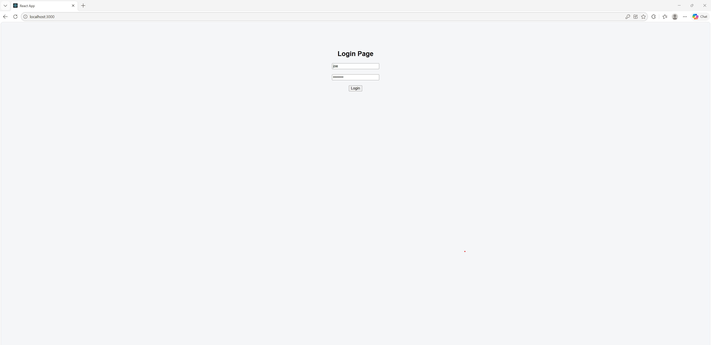
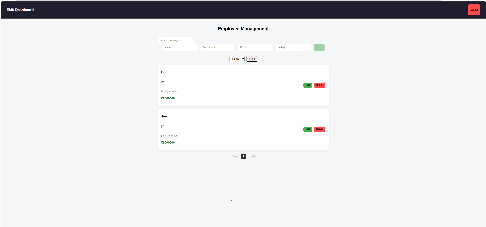
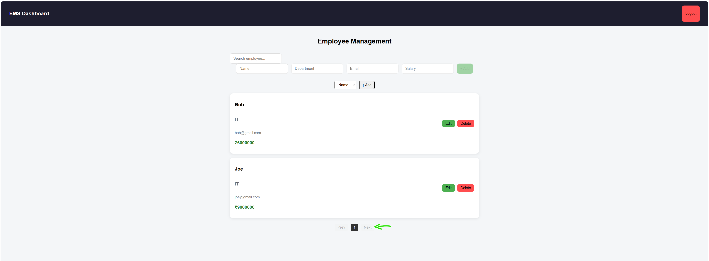
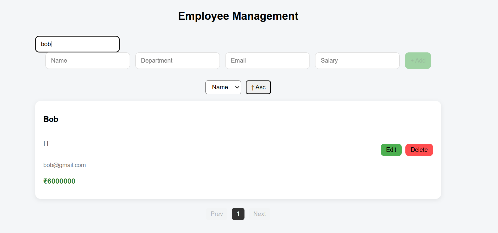

#  Employee Management System

A full-stack Employee Management System built with **React, Spring Boot, and MySQL**, featuring authentication, role-based access control, and Dockerized backend services.

---

##  Tech Stack

* **Frontend**: React.js, Axios, CSS
* **Backend**: Spring Boot, Spring Security, JWT
* **Database**: MySQL
* **DevOps**: Docker, Docker Compose

---

##  Features

*  JWT Authentication (Login/Register)
*  Role-Based Access (Admin/User)
*  Add /  Edit /  Delete Employees
*  Search Employees (server-side)
*  Pagination (Spring Pageable)
*  Sorting (Name / Salary)
*  Clean UI with cards & responsive layout
*  Toast notifications & loading states
*  Dockerized backend & database

---

##  Architecture

```
React (Frontend)
      ↓
Spring Boot API (Backend)
      ↓
MySQL (Database)
```

---

##  Setup Instructions

### 1. Clone the repo

```
git clone <your-repo-url>
cd employee-management-system
```

### 2. Start Backend + DB (Docker)

```
docker-compose up -d mysql backend
```

### 3. Start Frontend

```
cd frontend
npm install
npm start
```

---

##  Environment Variables

Create `.env` in frontend:

```
REACT_APP_API_URL=http://localhost:8080
```

---

## 📸 Screenshots

### Login


### Dashboard


### Pagination


### Search


---

##  Future Improvements

* Nginx reverse proxy
* Full Dockerized frontend
* CI/CD pipeline
* Deployment on AWS / Render

---

## Author
Aiswarya George
